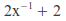
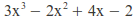
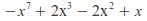

.. currentmodule:: pypol

.. |c_3| image:: images/c_3.gif

Functions
=========

pypol module has some functions to work with polynomials

.. hlist::

    * :func:`polynomial`
    * :func:`algebraic_fraction`
    * :func:`monomial`
    * :func:`poly1d`
    * :func:`poly1d_2`
    * :func:`gcd`
    * :func:`lcm`

poly1d
------

.. autofunction:: poly1d

poly1d_2
--------

.. autofunction:: poly1d_2

polynomial
----------

.. autofunction:: polynomial

.. _syntax-rules:

:func:`polynomial`'s syntax rules
+++++++++++++++++++++++++++++++++

Powers can be expressed using the ``^`` symbol. If a digit follows a letter then it is interpreted as an exponent. So the following expressions are equal::

    >>> polynomial('2x^3y^2 + 1') == polynomial('2x3y2 + 1')
    True

        
but if there is a white space after the letter then the digit is interpreted as a positive coefficient.
So this::

    >>> polynomial('2x3y 2 + 1')

represents this polynomial::

        2x^3y + 3

::

    >>> polynomial('2x3y 2 + 1')
    + 2x^3y + 3

algebraic_fraction
------------------

.. autofunction:: algebraic_fraction

monomial
--------

.. autofunction:: monomial

parse_polynomial
----------------

.. autofunction:: parse_polynomial

gcd
---

.. autofunction:: gcd

lcm
---

.. autofunction:: lcm

.. seealso:: :mod:`pypol.funcs` for utility functions.