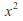
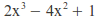
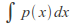
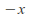
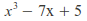
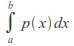
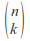
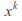
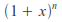
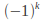
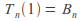
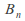
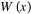
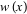
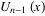
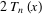
.. |p1| image:: images/quad_poly.gif
.. |p2| image:: images/quad_eq.gif
    :alt: Quadratic equation
.. |p8_5| image:: images/newton.gif
    :alt: Newton's method
.. |p9| image:: images/halley.gif
    :alt: Halley's method
.. |p10| image:: images/householder.gif
    :alt: Householder's method
.. |p21| image:: images/schroder.gif
    :alt: Schröder's method
.. |p22| image:: images/cubic_eq.gif
.. |p23| image:: images/laguerre.gif
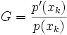
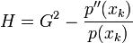