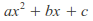
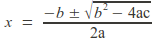
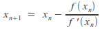
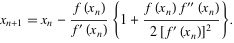
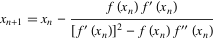
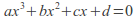
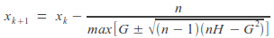

.. module:: pypol.roots
    :synopsis: A collection of some root- finding algorithm
.. moduleauthor:: Michele Lacchia (michelelacchia@gmail.com)
.. sectionauthor:: Michele Lacchia (michelelacchia@gmail.com)

.. |p9| image:: images/halley.gif
    :alt: Halley's method

The :mod:`roots` module
=======================

.. versionadded:: 0.4

Here are some root-finding algorithm, such as :func:`ruffini`'s method, :func:`quadratic` formula, :func:`cubic` formula, :func:`newton`'s method, :func:`halley`'s method, :func:`householder`'s method, :func:`schroeder`'s method, :func:`brent`'s method, and :func:`bisection`.

ruffini
+++++++

.. autofunction:: ruffini

quadratic
+++++++++

.. autofunction:: quadratic

cubic
+++++

.. autofunction:: cubic

newton
++++++

.. autofunction:: newton

halley
++++++

.. autofunction:: halley

householder
+++++++++++

.. autofunction:: householder

schroeder
+++++++++

.. autofunction:: schroeder

laguerre
++++++++

.. autofunction:: laguerre

durand_kerner
+++++++++++++

.. autofunction:: durand_kerner

brent
+++++

.. autofunction:: brent

bisection
+++++++++

.. autofunction:: bisection